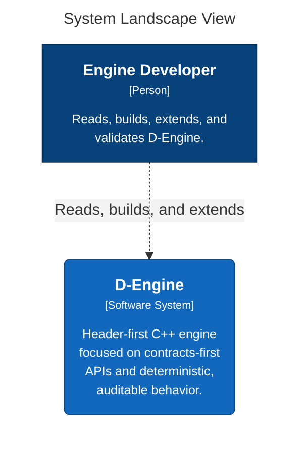

# Landscape

This page is generated from the Structurizr workspace.
It may be overwritten by tooling.

```mermaid
graph LR
  linkStyle default fill:#ffffff

  subgraph diagram ["System Landscape View"]
    style diagram fill:#ffffff,stroke:#ffffff

    1["<div style='font-weight: bold'>Engine Developer</div><div style='font-size: 70%; margin-top: 0px'>[Person]</div><div style='font-size: 80%; margin-top:10px'>Reads, builds, extends, and<br />validates D-Engine.</div>"]
    style 1 fill:#08427b,stroke:#052e56,color:#ffffff
    2("<div style='font-weight: bold'>D-Engine</div><div style='font-size: 70%; margin-top: 0px'>[Software System]</div><div style='font-size: 80%; margin-top:10px'>Header-first C++ engine<br />focused on contracts-first<br />APIs and deterministic,<br />auditable behavior.</div>")
    style 2 fill:#1168bd,stroke:#0b4884,color:#ffffff

    1-. "<div>Reads, builds, and extends</div><div style='font-size: 70%'></div>" .->2

  end
```

