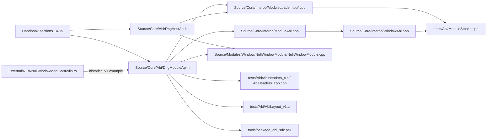

# ABI and Modules

> Navigation map. Normative rules live in the handbook and ABI headers.

## Purpose

This map explains the current stable C ABI boundary for loadable modules and the
helper code around it.

## Normative references

- `D-Engine_Handbook.md`, sections 14 and 15
- `Source/Core/Abi/DngModuleApi.h`
- `Source/Core/Abi/DngHostApi.h`
- `Source/Core/Abi/DngWindowApi.h`

## Implementation map

## Confirmed files in this repository

- `Source/Core/Abi/DngModuleApi.h`
- `Source/Core/Abi/DngHostApi.h`
- `Source/Core/Abi/DngWindowApi.h`
- `Source/Core/Interop/ModuleLoader.hpp`
- `Source/Core/Interop/ModuleLoader.cpp`
- `Source/Core/Interop/ModuleAbi.hpp`
- `Source/Core/Interop/WindowAbi.hpp`
- `Source/Modules/Window/NullWindowModule/NullWindowModule.cpp`
- `External/Rust/NullWindowModule/src/lib.rs`
- `tests/Abi/AbiHeaders_c.c`
- `tests/Abi/AbiHeaders_cpp.cpp`
- `tests/Abi/AbiLayout_v1.c`
- `tests/Abi/ModuleSmoke.cpp`
- `tools/package_abi_sdk.ps1`

## Important repo-specific note

The current in-repo module contract is the v2 module catalogue in
`Source/Core/Abi/DngModuleApi.h`, and the C++ null window module implements that
shape today.

`External/Rust/NullWindowModule/src/lib.rs` is still useful as an interop
example, but it exports the older v1 shape and should be read as historical
interop evidence, not as the current v2 reference implementation.

## Validation path

- `ModuleLoader` validates the generic module catalogue and shutdown pairing before typed access happens.
- `ModuleAbi.hpp` provides generic catalogue lookup; `WindowAbi.hpp` narrows that into the window-specific typed table.
- `ModuleSmoke.cpp` exercises the end-to-end host path: load module, locate `dng.window`, call create/get_size/set_title/destroy, then shutdown and unload.
- `AbiHeaders_*.c*` and `AbiLayout_v1.c` act as proof that the ABI headers remain consumable from C and C++ and that key layouts stay explicit.

## Review checklist

- Is the C ABI boundary isolated in `Source/Core/Abi/`?
- Does `ModuleLoader` validate the generic catalogue shape before use?
- Do typed helpers such as `WindowAbi.hpp` keep subsystem validation outside the generic loader?
- Are module lifetime and shutdown responsibilities explicit?
- Does `ModuleSmoke.cpp` exercise the supported load path?
