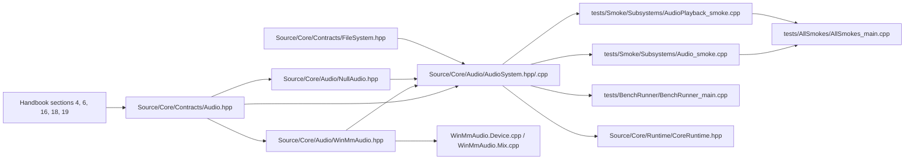

# Audio

> Navigation map. Normative rules live in the handbook and audio headers.

## Purpose

This map explains the current audio slice as a contract-first system with a
deterministic null backend, a WinMM-backed platform path, clip loading, stream
loading, and runtime integration.

## Normative references

- `D-Engine_Handbook.md`, sections 4, 6, 16, 18, and 19
- `Source/Core/Contracts/Audio.hpp`
- `Source/Core/Audio/AudioSystem.hpp`

## Implementation map

## Confirmed files in this repository

- `Source/Core/Contracts/Audio.hpp`
- `Source/Core/Contracts/FileSystem.hpp`
- `Source/Core/Audio/AudioSystem.hpp`
- `Source/Core/Audio/AudioSystem.cpp`
- `Source/Core/Audio/NullAudio.hpp`
- `Source/Core/Audio/WinMmAudio.hpp`
- `Source/Core/Audio/WinMmAudio.cpp`
- `Source/Core/Audio/WinMmAudio.Device.cpp`
- `Source/Core/Audio/WinMmAudio.Mix.cpp`
- `Source/Core/Audio/WinMmAudioInternal.hpp`
- `Source/Core/Runtime/CoreRuntime.hpp`
- `tests/Smoke/Subsystems/Audio_smoke.cpp`
- `tests/Smoke/Subsystems/AudioPlayback_smoke.cpp`
- `tests/BenchRunner/BenchRunner_main.cpp`
- `tests/AllSmokes/AllSmokes_main.cpp`

## Validation path

- `Audio.hpp` defines the backend-agnostic contract: voice commands, bus gains, and pull-based mixing.
- `NullAudio.hpp` is the deterministic reference backend used by CI, core smokes, and runtime fallback.
- `AudioSystem.hpp/.cpp` owns command queuing, clip lifetime, stream binding, backend selection, and fallback policy.
- `WinMmAudio*` files implement the current Windows platform path behind the contract and system facade.
- `Audio_smoke.cpp` verifies queueing, null-platform fallback behavior, and lifecycle semantics.
- `AudioPlayback_smoke.cpp` exercises real clip loading, stream clips, playback controls, bus gain behavior, and deterministic sample hashes when the platform backend is available.
- `BenchRunner_main.cpp` uses the audio path as part of the measurable performance surface.

## Review checklist

- Does the contract keep ownership, buffering, and mix semantics explicit?
- Does `AudioSystem` own backend selection and command queueing instead of exposing platform details upward?
- Is `NullAudio` still the deterministic reference backend for CI and fallback paths?
- Does the platform path stay behind the contract rather than leaking WinMM details into callers?
- Do the smokes cover both pure null behavior and real playback behavior?
