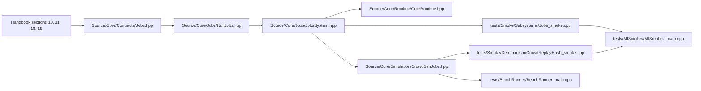

# Jobs

> Navigation map. Normative rules live in the handbook and jobs headers.

## Purpose

This map explains the current jobs slice as a deterministic M0 system: a
backend-agnostic contract, an inline null backend, a thin system facade, and
downstream usage in crowd simulation and runtime orchestration.

## Normative references

- `D-Engine_Handbook.md`, sections 10, 11, 18, and 19
- `Source/Core/Contracts/Jobs.hpp`
- `Source/Core/Jobs/JobsSystem.hpp`

## Implementation map

## Confirmed files in this repository

- `Source/Core/Contracts/Jobs.hpp`
- `Source/Core/Jobs/NullJobs.hpp`
- `Source/Core/Jobs/JobsSystem.hpp`
- `Source/Core/Runtime/CoreRuntime.hpp`
- `Source/Core/Simulation/CrowdSimJobs.hpp`
- `tests/Smoke/Subsystems/Jobs_smoke.cpp`
- `tests/Smoke/Determinism/CrowdReplayHash_smoke.cpp`
- `tests/BenchRunner/BenchRunner_main.cpp`
- `tests/SelfContain/Jobs_header_only.cpp`
- `tests/AllSmokes/AllSmokes_main.cpp`

## Validation path

- `Jobs.hpp` defines the contract around job submission, batches, counters, and `ParallelFor`.
- `NullJobs.hpp` is the deterministic reference backend that executes inline and records lightweight stats.
- `JobsSystem.hpp` is the system-level facade that can own the null backend or accept an injected external backend.
- `Jobs_smoke.cpp` proves the basic lifecycle, validation, counters, and deterministic inline semantics.
- `CrowdSimJobs.hpp` shows the current downstream shape of jobs-aware simulation code.
- `CrowdReplayHash_smoke.cpp` and `BenchRunner_main.cpp` prove that the jobs surface is not just abstract API design; it participates in determinism checks and benchmarks.

## Review checklist

- Does the contract keep submission and waiting semantics explicit and allocation-free at the boundary?
- Is the null backend still deterministic and easy to reason about?
- Does `JobsSystem` own the facade without burying hidden scheduling policy?
- Are downstream uses such as crowd simulation still aligned with replay-friendly ordering?
- Do tests cover both the local facade and real downstream usage?
