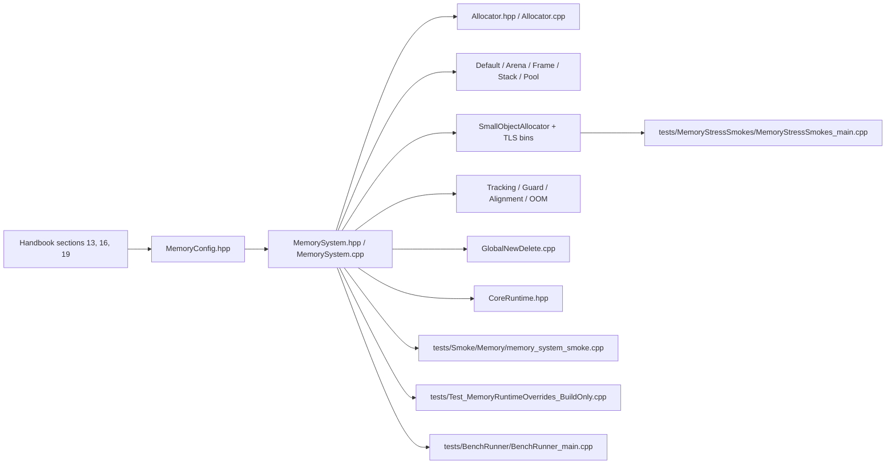

# Memory

> Navigation map. Normative rules live in the handbook and memory headers.

## Purpose

This map explains how memory config, allocator families, lifecycle wiring, and
validation fit together in the current repository.

## Normative references

- `D-Engine_Handbook.md`, sections 13, 16, and 19
- `Source/Core/Memory/MemoryConfig.hpp`
- `Source/Core/Memory/MemorySystem.hpp`

## Implementation map

## Confirmed files in this repository

- `Source/Core/Memory/Allocator.hpp`
- `Source/Core/Memory/Allocator.cpp`
- `Source/Core/Memory/MemoryConfig.hpp`
- `Source/Core/Memory/MemorySystem.hpp`
- `Source/Core/Memory/MemorySystem.cpp`
- `Source/Core/Memory/DefaultAllocator.hpp`
- `Source/Core/Memory/ArenaAllocator.hpp`
- `Source/Core/Memory/FrameAllocator.hpp`
- `Source/Core/Memory/FrameScope.hpp`
- `Source/Core/Memory/StackAllocator.hpp`
- `Source/Core/Memory/PoolAllocator.hpp`
- `Source/Core/Memory/PageAllocator.hpp`
- `Source/Core/Memory/SmallObjectAllocator.hpp`
- `Source/Core/Memory/SmallObjectAllocator.cpp`
- `Source/Core/Memory/SmallObjectTLSBins.hpp`
- `Source/Core/Memory/AllocatorAdapter.hpp`
- `Source/Core/Memory/TrackingAllocator.hpp`
- `Source/Core/Memory/TrackingAllocator.cpp`
- `Source/Core/Memory/GuardAllocator.hpp`
- `Source/Core/Memory/Alignment.hpp`
- `Source/Core/Memory/OOM.hpp`
- `Source/Core/Memory/GlobalNewDelete.cpp`
- `Source/Core/Runtime/CoreRuntime.hpp`
- `tests/Smoke/Memory/memory_system_smoke.cpp`
- `tests/MemoryStressSmokes/MemoryStressSmokes_main.cpp`
- `tests/Test_MemoryRuntimeOverrides_BuildOnly.cpp`
- `tests/BenchRunner/BenchRunner_main.cpp`

## Validation path

- `MemorySystem` is the public lifecycle facade that resolves runtime overrides and exposes the active allocator graph.
- `CoreRuntime.hpp` proves that memory ownership is part of runtime orchestration, not a detached utility.
- `memory_system_smoke.cpp` checks functional behavior, `Test_MemoryRuntimeOverrides_BuildOnly.cpp` checks override resolution, and `MemoryStressSmokes_main.cpp` isolates long-running allocator stress from standard smokes.
- `BenchRunner_main.cpp` keeps allocator cost visible through `ns/op`, `bytes/op`, and `allocs/op` reporting.

## Review checklist

- Are effective defaults and runtime override rules visible in `MemoryConfig.hpp` and `MemorySystem`?
- Are allocator contracts readable from headers before reading `.cpp` files?
- Is stress coverage kept separate from the standard smoke executable?
- Do benches and smokes both cover memory behavior instead of relying on one signal only?
- Are alignment and OOM helpers part of the same story instead of hidden implementation detail?
