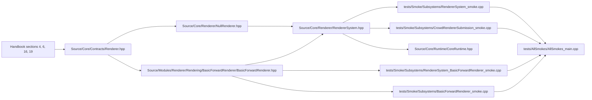

# Renderer M0

> Navigation map. Normative rules live in the handbook and renderer headers.

## Purpose

This map explains the current renderer slice as the clearest in-repo example of
the Contract / backend / system pattern, including the injected backend path.

## Normative references

- `D-Engine_Handbook.md`, sections 4, 6, 16, and 19
- `Source/Core/Contracts/Renderer.hpp`
- `Source/Core/Renderer/RendererSystem.hpp`

## Implementation map

## Confirmed files in this repository

- `Source/Core/Contracts/Renderer.hpp`
- `Source/Core/Renderer/NullRenderer.hpp`
- `Source/Core/Renderer/RendererSystem.hpp`
- `Source/Core/Runtime/CoreRuntime.hpp`
- `Source/Modules/Renderer/Rendering/BasicForwardRenderer/BasicForwardRenderer.hpp`
- `tests/Smoke/Subsystems/RendererSystem_smoke.cpp`
- `tests/Smoke/Subsystems/RendererSystem_BasicForwardRenderer_smoke.cpp`
- `tests/Smoke/Subsystems/BasicForwardRenderer_smoke.cpp`
- `tests/Smoke/Subsystems/CrowdRendererSubmission_smoke.cpp`
- `tests/Renderer_BasicForwardRenderer_demo.cpp`
- `tests/AllSmokes/AllSmokes_main.cpp`

## Validation path

- `Renderer.hpp` is the backend-agnostic contract surface.
- `NullRenderer.hpp` is the deterministic in-tree reference backend.
- `BasicForwardRenderer.hpp` proves the injected backend path used by `RendererSystem.hpp`.
- `CoreRuntime.hpp` shows where renderer lifecycle joins the wider runtime.
- The smoke set covers null backend behavior, injected backend behavior, and crowd submission shape.

## Review checklist

- Does the contract stay backend-agnostic and allocation-free at the boundary?
- Does `RendererSystem.hpp` own lifecycle and dispatch rather than leaking backend details upward?
- Is `NullRenderer.hpp` still the deterministic reference backend?
- Does the injected backend path stay simple enough for module or example backends to plug in cleanly?
- Do smokes cover both the null path and the injected `BasicForwardRenderer` path?
