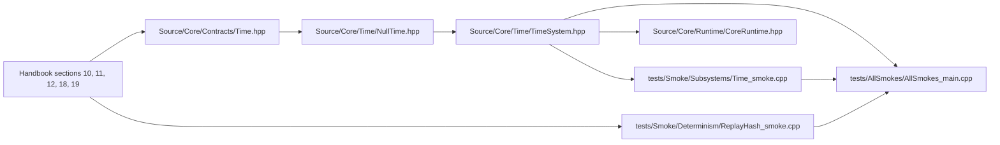

# Time

> Navigation map. Normative rules live in the handbook and time headers.

## Purpose

This map explains the current time slice as the contract/system pair that feeds
frame timing into the runtime while staying compatible with deterministic,
replay-oriented execution.

## Normative references

- `D-Engine_Handbook.md`, sections 10, 11, 12, 18, and 19
- `Source/Core/Contracts/Time.hpp`
- `Source/Core/Time/TimeSystem.hpp`

## Implementation map

## Confirmed files in this repository

- `Source/Core/Contracts/Time.hpp`
- `Source/Core/Time/NullTime.hpp`
- `Source/Core/Time/TimeSystem.hpp`
- `Source/Core/Runtime/CoreRuntime.hpp`
- `tests/Smoke/Subsystems/Time_smoke.cpp`
- `tests/Smoke/Determinism/ReplayHash_smoke.cpp`
- `tests/AllSmokes/AllSmokes_main.cpp`
- `Docs/TimePolicy.md`

## Validation path

- `Time.hpp` defines the backend-agnostic contract around monotonic sampling and frame boundaries.
- `NullTime.hpp` is the deterministic reference backend that advances by a fixed step without wall-clock dependence.
- `TimeSystem.hpp` turns backend samples into `FrameTime` values and owns the system-level initialization path.
- `Time_smoke.cpp` proves the system lifecycle, capability flags, and monotonically increasing frame progression.
- `CoreRuntime.hpp` shows where time becomes part of the unified runtime tick.
- `ReplayHash_smoke.cpp` is not a direct consumer of `TimeSystem`, but it is relevant evidence for the replay-first determinism policy this subsystem is meant to support.

## Review checklist

- Does the contract separate time sampling from platform detail and wall-clock assumptions?
- Is `NullTime` still the deterministic reference backend?
- Does `TimeSystem` own frame progression rather than leaking raw backend state upward?
- Does runtime integration preserve the intended tick semantics?
- Are determinism-facing tests still aligned with the documented policy?
